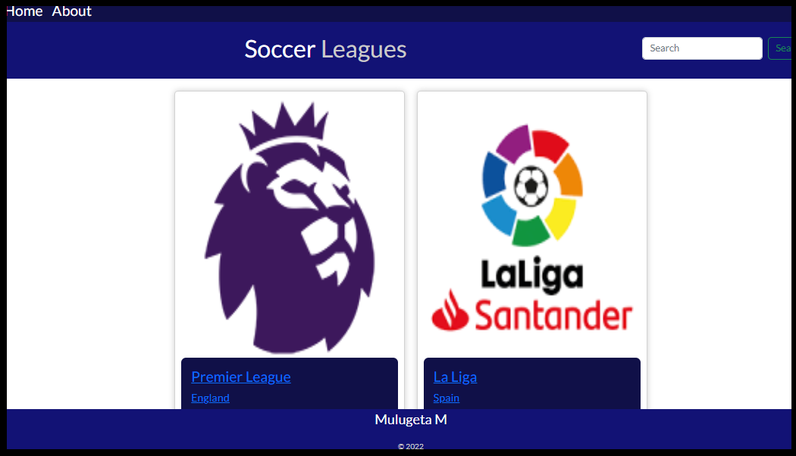

# React Capstone: Femaous-Leagues

> Femaous-Leagues which is built using React, Redux, SpaceX APIs, and react bootstrap allows you to:

> * See football leagues.
> * Search football leagues.
> * See teams in the league.
> * See stats of the teams.

(./src/Assets/scren-shot-mob.png "Foot-mob")

## Built With

- **HTML**
- **CSS**
- **JavaScript**
- **react-bootstrap**
- **Gitflow**
- **React**
- **Redux**
- **SpaceX APIs**

## Live demo

[Click here for Live Demo](https://deploy-preview-1--famous-swan-f14d8e.netlify.app/)

## Getting Started

### Steps to run the project

#### 1 - Git Clone.

```
git clone https://github.com/belmeetmule/react-capstone.git
```
#### 2 - Install node packages.

```
npm install
```

#### 3 - run the project

```
npm start
```

## Available Scripts

In the project directory, you can run:

### `npm start`

Runs the app in the development mode.

### `npm test`

Launches the test runner in the interactive watch mode.

### `npm run build`

Builds the app for production to the `build` folder.

### `npm run eject`

**Note: this is a one-way operation. Once you `eject`, you can't go back!**

If you aren't satisfied with the build tool and configuration choices, you can `eject` at any time. This command will remove the single build dependency from your project.

## Author

## 👨‍💻 Mulugeta
- GitHub: [@belmeetmule](https://github.com/belmeetmule)
- Twitter: [@belmeetmule](https://twitter.com/belmeetmule)
- LinkedIn: [belmeetmule](https://linkedin.com/in/belmeetmule)


## Acknowledgments

> Special thanks to the co-creator of Redux (Dan Abramov) for his complete course on redux actions and store methods.

> And thanks to all the developers whose code, documentations, and efforts helped us doing this project.

## 🤝 Contributing

Contributions, issues, and feature requests are welcome!

Feel free to check the [issues page](../../issues/).

## Show your support

Please give a ⭐️ if you like this project!

## 📝 License
- This project is [MIT](./LICENSE) licensed.
